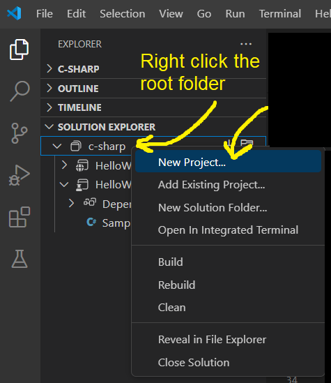

# C# With VSCode

## Purpose

The purpose of this repo is to 
- Explain how to quickly setup your local C# development environment and IDE
- Be able to create and run C# unit tests using `xunit`

## Setup / Installation

- Install / open [vscode](https://code.visualstudio.com/download)
- Open a vscode terminal and check to see if dotnet is installed

```
dotnet --version
```

- Install [dotnet](https://dotnet.microsoft.com/en-us/download) if you don't already have it installed
- Make sure you have the vscode plugin installed: [Base language support for C#](https://marketplace.visualstudio.com/items?itemName=ms-dotnettools.csharp) by Microsoft
- Make sure you have the vscode plugin installed: [C# Dev Kit](https://marketplace.visualstudio.com/items?itemName=ms-dotnettools.csdevkit) by Microsoft
- Make sure you have the vscode plugin installed: [IntelliCode for C# Dev Kit](https://marketplace.visualstudio.com/items?itemName=ms-dotnettools.vscodeintellicode-csharp) by Microsoft

## New Project (CLI)

You can create a new C# project from a template. To see what templates are available:

```
dotnet new --list
```

Create new unit tests:

``` shell
# example
dotnet new xunit -n HelloWorld.UnitTests

# format
dotnet new xunit -n <ProjectName>.<TestPackage>
```

## New Project (vscode)




## Unit Test Organization

Unit tests are often kept in a separate "project" that is a sibling project of the production code being tested. 

Example folder structure:

```
RootFolder
----Project
    ----CodeClass.cs
----Project.UnitTests
    ----CodeClassTests.cs
```

## Linking Production Project to the Unit Test Project

Don't forget to "`Add project reference`" to your "UnitTests" project so that the production code being tested can be found from within the `CodeClassTests` files:

- Right click the `UnitTests` project folder
- Select `Add project reference`
- Choose the name of the project folder being tested


This will create a project reference within the .UnitTests project:

`{folderRoot}\HelloWorld.UnitTests\HelloWorld.UnitTests.csproj`:
```
<ProjectReference Include="..\HelloWorld\HelloWorld.csproj" />
```

This **ProjectReference** allows the unit test to have access to the tested project classes.

## Running Tests

After changes are made, these changes must be built before they are recognized in tests.

### Build (CLI)

``` shell
# Run in {folderRoot} to build all sub-projects
dotnet build
```

### Run Tests (CLI)

```
dotnet test
```

### Run Tests (vscode)

You can run individual unit tests within a test file. Green test buttons should appear in the file after you successfully build your code. 


Or you can use the vscode C# testing plugin (installed already earlier) to run tests.


## Sample Code

The full code sample (both unit-tests and tested code) can be found here:

- [Tested Code](./HelloWorld/SampleClass.cs)
- [Unit Tests for Tested Code](./HelloWorld.UnitTests/SampleClassTests.cs)

## End

